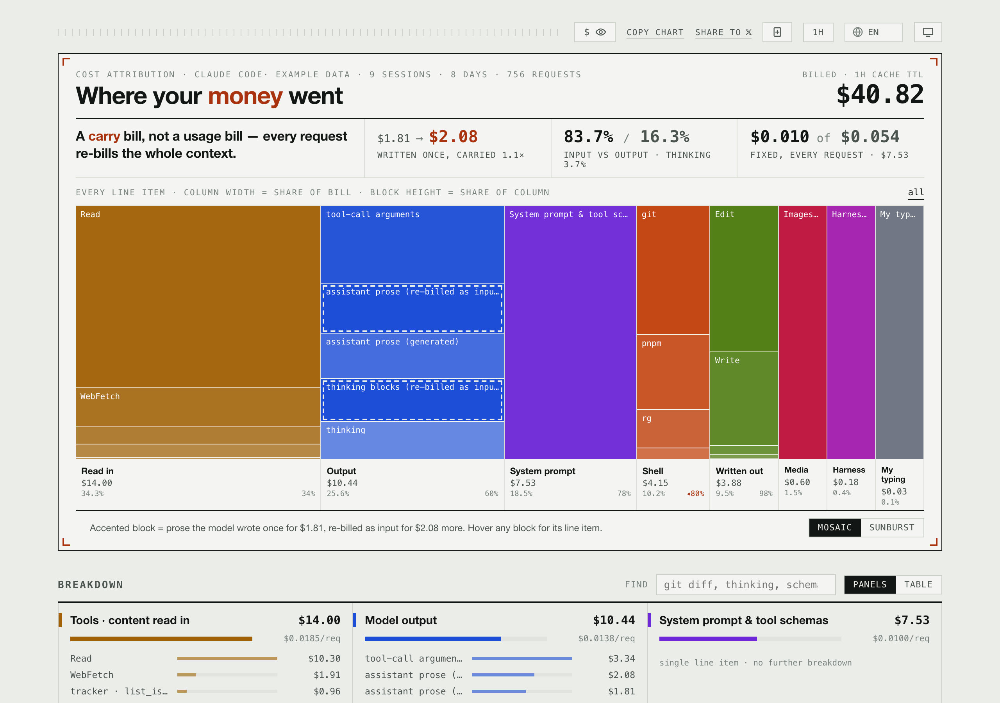
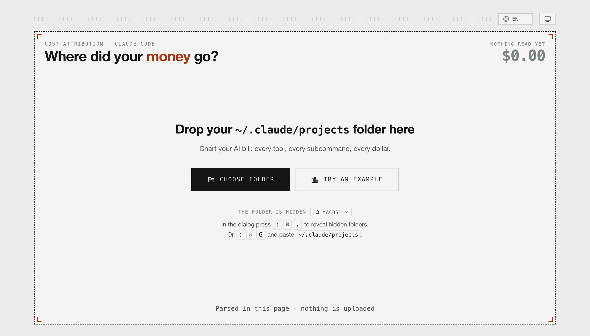
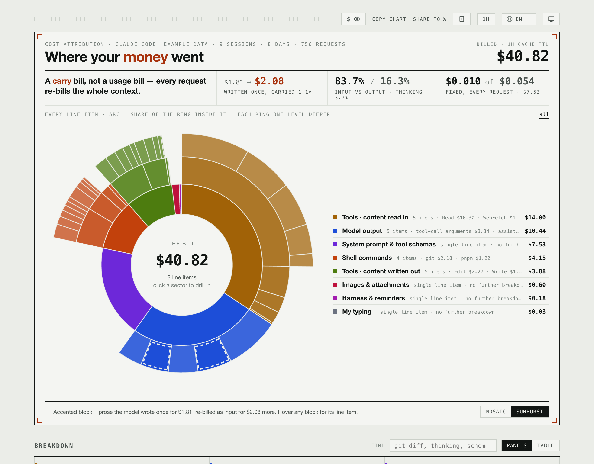

# Where did your Claude Code money go?

Every dollar traced to whatever put the tokens in context — per tool, per shell command, per
subcommand.

### **→ [token-billing.vercel.app](https://token-billing.vercel.app/)**



## Use it

1. Open [token-billing.vercel.app](https://token-billing.vercel.app/).
2. Drop your `~/.claude/projects` folder on the page (or one project inside it).
3. Read the bill.

No account, no upload, no install. In a hurry? Press **Try an example** to see a full report
built from invented sessions.



**The folder is hidden**, so pickers won't show it until you name it:

| | |
|---|---|
| macOS | In the dialog press <kbd>⇧</kbd><kbd>⌘</kbd><kbd>G</kbd>, paste `~/.claude/projects` |
| Windows | Type `%USERPROFILE%\.claude\projects` into the *Folder* box |
| Linux | Press <kbd>Ctrl</kbd>+<kbd>L</kbd>, type the path |

Or run `open ~/.claude/projects` and drag the folder onto the page.

## Read it

Two views of the same tree. The **mosaic** compares amounts — column width is share of the
bill. The **sunburst** shows how deep the money goes — one ring per drill level. Click
anything to drill in; Back comes out.



The toolbar covers amounts (for screenshots), switches cache TTL, copies the chart, and
changes language — English, 简体中文, 日本語, Español, Français, Deutsch.

## From the terminal

Same engine, no browser needed to do the work. Needs **Node 22.18+**.

```sh
npx token-billing                                  # ~/.claude/projects, then opens the report
npx token-billing ~/.claude/projects/some-project  # just one project
npx token-billing --print                          # print the URL instead of opening it
```

Nothing to install and no dependencies — it is one bundled file that imports only Node builtins.

It prices everything on your machine and puts the *answer* — not your transcripts — in the
URL's fragment, which browsers never send to a server. `--print` is for a machine reached over
SSH: the URL goes to stdout and the totals to stderr, so it pipes.

## Nothing is uploaded

Your transcripts are read and priced inside the page. There is no server to send them to, and
the build fails if anything in the app reaches the network. The hosted copy counts pageviews
and reports one of two strings, `/` or `/report` — never a drill path, because those are built
from your own tool and server names.

Want it fully offline? `pnpm build` writes `cost-report.html` — one double-clickable file that
works from disk and counts nothing.

## Why it isn't just token counts

Billing is **per request**, and every request bills the *entire* input prefix again. So a piece
of content doesn't cost its face value — it costs its share of **every later request it
survives in**. That's carry cost, and it's why a cheap-looking command that sits in context all
session can outspend an expensive one that gets compacted away.

Exact billed cost comes from each request's `usage` field, then gets split across what was in
context by token share. **Totals are exact; the per-row split is estimated.**

## Caveats

- Transcripts are live files that Claude Code rewrites as sessions compact, so the same folder
  can give different totals days apart.
- Thinking is a residual — `output_tokens` includes it even when no thinking block is saved.
- Unknown models are reported as unpriced, never dropped.

## Contributing

```sh
git clone https://github.com/HerringtonDarkholme/token-cost && cd token-cost
pnpm install
pnpm dev        # the page, on http://127.0.0.1:8000
pnpm cli        # the command, straight from source
pnpm check      # format, lint, typecheck, both builds, all five test suites
```

See [CLAUDE.md](CLAUDE.md) for repo conventions and [DESIGN_BRIEF.md](DESIGN_BRIEF.md) for the
UI constraints.

MIT
